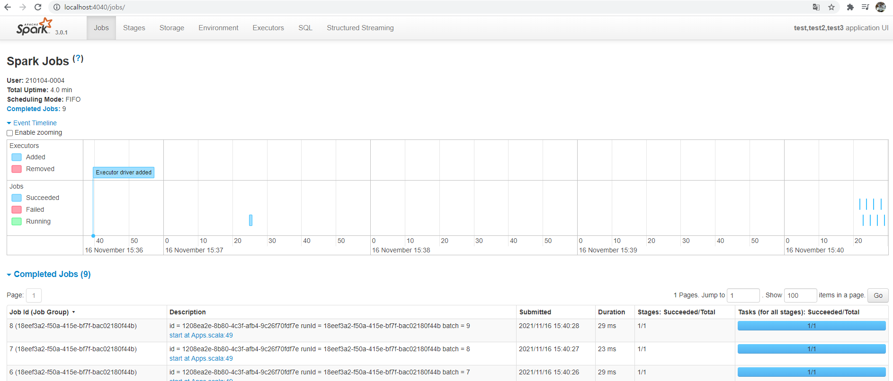
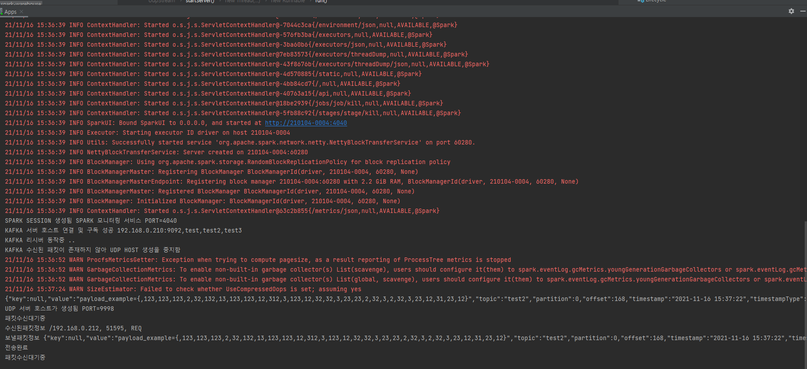
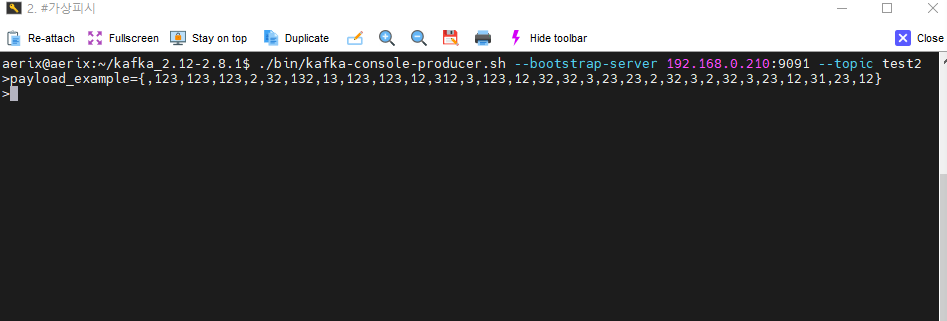
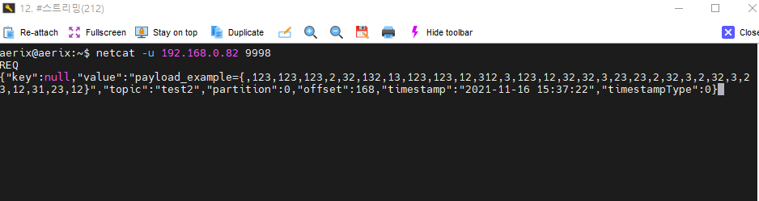

StreamingServer
===================================
Kafka connect(sink) 파트 기능을 하는 Spark drive 기반의 scala 프로젝트 입니다.

- 1.0v
  - 파일럿 테스트 정상동작
  - 예정) 코드 정리, 도커 배포

Introduction
------------

Kafka topic을 구독하여 패킷을 받아 json 형식으로 변환합니다.
변환된 데이터를 UDP 호스트 서버를 열어 배포 준비를 합니다.
클라이언트는 해당 UDP 프로토콜의 Body-Packet에 REQ를 담아 요청하면 
호스트 측은 json 형식의 kafka-payload로 응답합니다.

###실행
src/main/scala/Apps.scala 

Prerequisites
--------------

- IntelliJ (scala 프로젝트 구성)
- IntelliJ Plugins
  - Azure Toolkit for IntelliJ (scala 프로젝트 구성을 위한 필수요소)
  - Scala
- Spark version : 3.0.1
- Scala version-major : 2.12.15
- Scala version-minor : 12
- openJDK 11
- maven : 4.0
- Hadoop : 3.2.2 (하둡 lib https://github.com/cdarlint/winutils.git)
- Kafka : aerix의 kafka docker-compose 빌드

###참고
- 스칼라 프로젝트 구성 : https://docs.microsoft.com/en-us/azure/hdinsight/spark/apache-spark-create-standalone-application
- 스칼라 한국어 도큐먼트 : https://spark-korea.github.io/docs/index.html
- 스칼라 영문 도큐먼트 : https://spark.apache.org/docs/3.2.0/
- 스칼라-카프카 연동 튜토리얼 : https://www.youtube.com/watch?v=E_hpyO-0NoM&ab_channel=LearningJournal

###주의
- Spark-Scala 프로젝트는 버전의 영향을 크게 받습니다.
  - openJDK11, spark 3.0 이상 부터 sbt로 라이브러리 구성 시 오류가 발생합니다.
  - maven을 통한 pom.xml 구성을 요구합니다. (가능하면 본 프로젝트 maven 정보 참고하여 작성할것..)

###설정파일 (파일내 주석 참고)
- 개발환경 : src/main/scala/configs/DEV.scala
- 배포환경 : src/main/scala/configs/PROD.scala

Support
-------
에어릭스 환경시스템사업부 /개발팀 김동연

Screenshots
-------------
 

License
-------
후에 기입